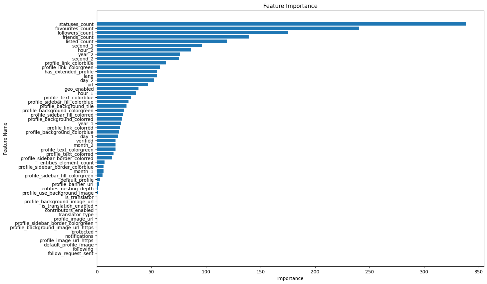

<center><font size=10><b>ML</b></font></center>
<center><font size=10><b>LAB 5 report</b></font></center>

<center><font size=5>王一鸣</font></center>

<center><font size=5>PB21000024</font></center>


```python

from google.colab import drive
drive.mount("/content/drive", force_remount=True)
```

    Mounted at /content/drive


```python
# Run some setup code for this notebook.
import pandas as pd

# Some more magic so that the notebook will reload external python modules;
# see http://stackoverflow.com/questions/1907993/autoreload-of-modules-in-ipython
%load_ext autoreload
%autoreload 2
%reload_ext autoreload
```


```python
def load_data(path):
    df = pd.read_json(path)
    df_expanded = df['user'].apply(lambda x: pd.Series(x))
    df = pd.concat([df.drop('user', axis=1), df_expanded], axis=1)
    return df

data_train = load_data("/content/drive/MyDrive/users/wangyiming/homework/assignment5/data/train.json")
data_test = load_data("/content/drive/MyDrive/users/wangyiming/homework/assignment5/data/test.json")
```

- 先按照数据的组织方式加载数据


```python
# encode the labels
from sklearn import preprocessing
le = preprocessing.LabelEncoder()
le.fit(data_train['label'])
#data_train['label_trans'] = le.transform(data_train['label'])
#data_test['label_trans'] = le.transform(data_test['label'])
#data_train['label_trans']
#data_test['label_trans']
```


```python
data_train.to_csv("/content/drive/MyDrive/users/wangyiming/homework/assignment5/data/train.csv",index=False)
data_test.to_csv("/content/drive/MyDrive/users/wangyiming/homework/assignment5/data/test.csv",index=False)
```


```python
!pip install "mxnet<2.0.0"
!pip install autogluon
```

```python
!pip uninstall vowpalwabbit
!pip install vowpalwabbit==9.8

```


```python
from autogluon.tabular import TabularDataset,TabularPredictor
train_data = TabularDataset('/content/drive/MyDrive/users/wangyiming/homework/assignment5/data/train.csv')
test_data = TabularDataset('/content/drive/MyDrive/users/wangyiming/homework/assignment5/data/test.csv')
id,label = 'id','label'
predictor = TabularPredictor(label=label).fit(train_data=train_data.drop(columns=['id','id_str']),presets='best_quality',hyperparameters='multimodal')
```


```python
from autogluon.tabular import TabularDataset,TabularPredictor
```


```python
test_data = TabularDataset('/content/drive/MyDrive/users/wangyiming/homework/assignment5/data/test.csv')
```


```python

predictor = TabularPredictor.load("/content/drive/MyDrive/users/wangyiming/homework/assignment5/AutogluonModels/ag-20240120_150601")
test_data['label']=predictor.predict(test_data)
```


---

- 以上是一个使用自动机器学习的例子，现在开始手动处理数据
---
# 配置环境


```python
!pip install matplotlib==3.2
```

​    


# 导入必需的包


```python
from google.colab import drive
drive.mount("/content/drive", force_remount=True)
```

    Mounted at /content/drive


```python
import pandas as pd
```

# 导入数据


```python
def load_data(path):
    df = pd.read_json(path)
    df.rename(columns={'created_at': 'created_at_1'}, inplace=True)
    df_expanded = df['user'].apply(lambda x: pd.Series(x))
    df = pd.concat([df.drop('user', axis=1), df_expanded], axis=1)
    df.rename(columns={'created_at': 'created_at_2'}, inplace=True)
    return df

data_train = load_data("/content/drive/MyDrive/users/wangyiming/homework/assignment5/data/train.json")
data_test = load_data("/content/drive/MyDrive/users/wangyiming/homework/assignment5/data/test.json")
```

# 处理缺失值和特征变换

- 观察了下数据，发现除了数值类型的数据，还存在一些以字符形式表示的或者字典形式的非结构化数据，需要进行特殊处理抽取里面的形式并转变为更好理解的方式


```python
data_train.describe()
```


<table border="1" class="dataframe">
  <thead>
    <tr style="text-align: right;">
      <th></th>
      <th>id</th>
      <th>followers_count</th>
      <th>friends_count</th>
      <th>listed_count</th>
      <th>favourites_count</th>
      <th>statuses_count</th>
    </tr>
  </thead>
  <tbody>
    <tr>
      <th>count</th>
      <td>1.986000e+03</td>
      <td>1.986000e+03</td>
      <td>1.986000e+03</td>
      <td>1986.000000</td>
      <td>1986.000000</td>
      <td>1.986000e+03</td>
    </tr>
    <tr>
      <th>mean</th>
      <td>2.310374e+16</td>
      <td>1.150564e+06</td>
      <td>2.068517e+04</td>
      <td>2935.426485</td>
      <td>14604.806647</td>
      <td>8.433909e+04</td>
    </tr>
    <tr>
      <th>std</th>
      <td>1.408191e+17</td>
      <td>6.923611e+06</td>
      <td>9.538992e+04</td>
      <td>18671.513621</td>
      <td>40080.914211</td>
      <td>1.579607e+05</td>
    </tr>
    <tr>
      <th>min</th>
      <td>1.591300e+04</td>
      <td>0.000000e+00</td>
      <td>0.000000e+00</td>
      <td>0.000000</td>
      <td>0.000000</td>
      <td>1.000000e+00</td>
    </tr>
    <tr>
      <th>25%</th>
      <td>8.047722e+07</td>
      <td>1.221250e+03</td>
      <td>3.275000e+02</td>
      <td>16.000000</td>
      <td>219.000000</td>
      <td>1.605700e+04</td>
    </tr>
    <tr>
      <th>50%</th>
      <td>3.024163e+08</td>
      <td>9.273700e+04</td>
      <td>8.670000e+02</td>
      <td>174.500000</td>
      <td>2611.500000</td>
      <td>3.962950e+04</td>
    </tr>
    <tr>
      <th>75%</th>
      <td>1.293598e+09</td>
      <td>2.336555e+05</td>
      <td>2.533500e+03</td>
      <td>1260.750000</td>
      <td>12878.000000</td>
      <td>8.997950e+04</td>
    </tr>
    <tr>
      <th>max</th>
      <td>1.079456e+18</td>
      <td>1.069380e+08</td>
      <td>2.141379e+06</td>
      <td>606500.000000</td>
      <td>886115.000000</td>
      <td>2.766520e+06</td>
    </tr>
  </tbody>
</table>


```python
import pandas as pd
from sklearn.preprocessing import LabelEncoder, StandardScaler
from datetime import datetime as dt
data_train['created_at_1'] = pd.to_datetime(data_train['created_at_1'])
data_test['created_at_1'] = pd.to_datetime(data_test['created_at_1'])


data_train['created_at_2'] = pd.to_datetime(data_train['created_at_2'])
data_test['created_at_2'] = pd.to_datetime(data_test['created_at_2'])
data_test['created_at_2']
```


    0     2012-10-20 17:18:56+00:00
    1     2010-02-05 15:13:14+00:00
    2     2009-02-03 20:58:44+00:00
    3     2016-11-30 18:26:00+00:00
    4     2010-12-29 07:19:35+00:00
                     ...           
    245   2009-01-29 12:47:34+00:00
    246   2009-12-31 09:33:16+00:00
    247   2014-03-20 06:54:50+00:00
    248   2011-09-26 21:36:17+00:00
    249   2015-06-04 21:12:23+00:00
    Name: created_at_2, Length: 250, dtype: datetime64[ns, UTC]


- 首先是时间类型的数据，考虑到机器人可能在某些特殊的时间进行大量的创建，所以我抽取了年月日分秒单独作为特征


```python
data_train['year_1'] = data_train['created_at_1'].dt.year
data_train['month_1'] = data_train['created_at_1'].dt.month
data_train['day_1'] = data_train['created_at_1'].dt.day
data_train['hour_1'] = data_train['created_at_1'].dt.hour
data_train['second_1'] = data_train['created_at_1'].dt.second

data_train.drop('created_at_1', axis=1, inplace=True)

data_train['year_2'] = data_train['created_at_2'].dt.year
data_train['month_2'] = data_train['created_at_2'].dt.month
data_train['day_2'] = data_train['created_at_2'].dt.day
data_train['hour_2'] = data_train['created_at_2'].dt.hour
data_train['second_2'] = data_train['created_at_2'].dt.second

data_train.drop('created_at_2', axis=1, inplace=True)

data_test['year_1'] = data_test['created_at_1'].dt.year
data_test['month_1'] = data_test['created_at_1'].dt.month
data_test['day_1'] = data_test['created_at_1'].dt.day
data_test['hour_1'] = data_test['created_at_1'].dt.hour
data_test['second_1'] = data_test['created_at_1'].dt.second

data_test.drop('created_at_1', axis=1, inplace=True)

data_test['year_2'] = data_test['created_at_2'].dt.year
data_test['month_2'] = data_test['created_at_2'].dt.month
data_test['day_2'] = data_test['created_at_2'].dt.day
data_test['hour_2'] = data_test['created_at_2'].dt.hour
data_test['second_2'] = data_test['created_at_2'].dt.second

data_test.drop('created_at_2', axis=1, inplace=True)
```


```python
data_train['url']
```


    0                          None
    1       https://t.co/IxMra2OEey
    2                          None
    3                          None
    4       https://t.co/rDVUTyCn9E
                     ...           
    1981                       None
    1982    https://t.co/uAZ5LhUnNT
    1983    https://t.co/Qfnt0mOUG3
    1984    https://t.co/vhcGaX7t9m
    1985                       None
    Name: url, Length: 1986, dtype: object


- 其次是网址类型的数据，有很多是缺失的，在这里缺失也是非常重要的信息，并且网址的来源也很重要，所以我抽取了根域名作为特征，并赋予缺失值missing


```python
import re
def extract_top_domain(url):
    if pd.isna(url):
        return 'missing'

    match = re.search(r'\.([a-zA-Z]+)(?:\/|$)', url)
    if match :
      return match.group(1)
    else :
      return 'unknown'

link_features = ['url', 'profile_background_image_url', 'profile_image_url', 'profile_banner_url','profile_background_image_url_https','profile_image_url_https'] # 定义你的链接特征
for feature in link_features:
    data_train[feature] = data_train[feature].apply(extract_top_domain)


    data_test[feature] = data_test[feature].apply(extract_top_domain)
data_train['profile_background_image_url']

```


    0       com
    1       com
    2       com
    3       com
    4       com
           ... 
    1981    com
    1982    com
    1983    com
    1984    com
    1985    com
    Name: profile_background_image_url, Length: 1986, dtype: object


```python
import pandas as pd

def calculate_nesting_depth(data, level=0):
    if isinstance(data, dict):
        return max([calculate_nesting_depth(v, level + 1) for k, v in data.items()], default=level)
    elif isinstance(data, list):
        return max([calculate_nesting_depth(item, level + 1) for item in data], default=level)
    else:
        return level

def count_elements(data):
    if isinstance(data, dict):
        return sum([count_elements(v) for v in data.values()])
    elif isinstance(data, list):
        return sum([count_elements(item) for item in data])
    else:
        return 1
```

- 观察数据还能发现有一些非结构化的数据比较麻烦，其内部是字典和相关链接，有多重嵌套，表示一些相关联的信息，按直觉来说，越复杂的关联更可能是真实地账户，于是在此我直接计算其复杂度，分别递归计算其嵌套深度和元素个数抽取特征


```python
data_train['entities_nesting_depth'] = data_train['entities'].apply(calculate_nesting_depth)
data_train['entities_element_count'] = data_train['entities'].apply(count_elements)
data_train.drop('entities', axis=1, inplace=True)

data_test['entities_nesting_depth'] = data_test['entities'].apply(calculate_nesting_depth)
data_test['entities_element_count'] = data_test['entities'].apply(count_elements)
data_test.drop('entities', axis=1, inplace=True)

data_test['entities_element_count']
```


```python
def hex_to_rgb(hex_color):
    hex_color = hex_color.lstrip('#')
    lv = len(hex_color)
    return tuple(int(hex_color[i:i + lv // 3], 16) for i in range(0, lv, lv // 3))

```

- 还有一些色彩类型的数据以字符的形式表示，将其转换成rgb形式具有明确的意义


```python
col_labels=["profile_link_color","profile_sidebar_border_color","profile_sidebar_fill_color","profile_text_color",'profile_background_color']
for col in col_labels:
  col_trans=[col+'red',col+'green',col+'blue']
  data_train[col_trans]=data_train[col].apply(lambda x: pd.Series(hex_to_rgb(x)))
  data_train.drop(col, axis=1, inplace=True)

  data_test[col_trans]=data_test[col].apply(lambda x: pd.Series(hex_to_rgb(x)))
  data_test.drop(col, axis=1, inplace=True)

```


```python
data_train.drop(['utc_offset','time_zone','id','id_str','location',], axis=1, inplace=True)
data_test.drop(['utc_offset','time_zone','id','id_str','location',], axis=1, inplace=True)
```


```python
data_train_text=data_train[['name', 'description','screen_name']]
#data_train.drop(['name', 'description','screen_name'], axis=1, inplace=True)
```


```python
data_train_text.describe()
```


<table border="1" class="dataframe">
  <thead>
    <tr style="text-align: right;">
      <th></th>
      <th>name</th>
      <th>description</th>
      <th>screen_name</th>
    </tr>
  </thead>
  <tbody>
    <tr>
      <th>count</th>
      <td>1986</td>
      <td>1986</td>
      <td>1986</td>
    </tr>
    <tr>
      <th>unique</th>
      <td>1977</td>
      <td>1853</td>
      <td>1986</td>
    </tr>
    <tr>
      <th>top</th>
      <td>.</td>
      <td></td>
      <td>HNakvi</td>
    </tr>
    <tr>
      <th>freq</th>
      <td>4</td>
      <td>133</td>
      <td>1</td>
    </tr>
  </tbody>
</table>


```python
'''
from sklearn.feature_extraction.text import CountVectorizer

def process_text_feature(df, column_name):
    """处理单个文本特征，并将生成的特征添加到原始DataFrame中"""
    vectorizer = CountVectorizer(analyzer='char')
    X = vectorizer.fit_transform(df[column_name])

    # 创建一个新的DataFrame，其中包含来自当前特征的词频数据
    feature_df = pd.DataFrame(X.toarray(), columns=vectorizer.get_feature_names_out())
    feature_df['length'] = df[column_name].apply(len)
    feature_df = feature_df.add_prefix(column_name + "_")

    return feature_df
def calculate_character_diversity(text):
    """计算文本中不同字符的数量"""
    return len(set(text))
# 示例DataFrame，包含多个文本特征

# 遍历所有文本特征
text_columns = ['name', 'description','screen_name']  # 定义您的文本列名称列表
for column in text_columns:
    feature_df = process_text_feature(data_train, column)
    data_train = pd.concat([data_train, feature_df], axis=1)
    diversity_column_name = column + '_char_diversity'
    data_train[diversity_column_name] = data_train[column].apply(calculate_character_diversity)

    feature_df = process_text_feature(data_test, column)
    data_test = pd.concat([data_test, feature_df], axis=1)
    diversity_column_name = column + '_char_diversity'
    data_train[diversity_column_name] = data_test[column].apply(calculate_character_diversity)


# 查看处理后的DataFrame
print(data_train)
'''
```


- 对于文本数据的处理，一开始打算用传统的词袋模型抽取一些特征，但是出现了维度爆炸的问题，于是先把文本数据拿掉，只考虑其它类型

- 对于处理过的类别类型，简单的转化成类别向量即可用于模型训练了


```python
import pandas as pd
from sklearn.preprocessing import LabelEncoder

# 选择object类型的列
object_cols = data_train.select_dtypes(include=['object']).columns

# 对每个object类型的列应用LabelEncoder
label_encoders = {}
data=pd.concat([data_train,data_test],axis=0)
for col in object_cols:
    le = LabelEncoder()
    if col in ['name', 'description','screen_name']:
      pass
    elif col!='label':

      data[col] = le.fit_transform(data[col])
      data_train[col]=le.transform(data_train[col])
      data_test[col]=le.transform(data_test[col])
    else:
      data_train[col] = le.fit_transform(data_train[col])

    label_encoders[col] = le  # 存储每个列的LabelEncoder以备后用

# 查看处理后的DataFrame
print(data_train)
```


```python
data_train.info()
```

    <class 'pandas.core.frame.DataFrame'>
    RangeIndex: 1986 entries, 0 to 1985
    Data columns (total 58 columns):
     #   Column                              Non-Null Count  Dtype 
    ---  ------                              --------------  ----- 
     0   label                               1986 non-null   int64 
     1   name                                1986 non-null   object
     2   screen_name                         1986 non-null   object
     3   description                         1986 non-null   object
     4   url                                 1986 non-null   int64 
     5   protected                           1986 non-null   bool  
     6   followers_count                     1986 non-null   int64 
     7   friends_count                       1986 non-null   int64 
     8   listed_count                        1986 non-null   int64 
     9   favourites_count                    1986 non-null   int64 
     10  geo_enabled                         1986 non-null   bool  
     11  verified                            1986 non-null   bool  
     12  statuses_count                      1986 non-null   int64 
     13  lang                                1986 non-null   int64 
     14  contributors_enabled                1986 non-null   bool  
     15  is_translator                       1986 non-null   bool  
     16  is_translation_enabled              1986 non-null   bool  
     17  profile_background_image_url        1986 non-null   int64 
     18  profile_background_image_url_https  1986 non-null   int64 
     19  profile_background_tile             1986 non-null   bool  
     20  profile_image_url                   1986 non-null   int64 
     21  profile_image_url_https             1986 non-null   int64 
     22  profile_banner_url                  1986 non-null   int64 
     23  profile_use_background_image        1986 non-null   bool  
     24  has_extended_profile                1986 non-null   bool  
     25  default_profile                     1986 non-null   bool  
     26  default_profile_image               1986 non-null   bool  
     27  following                           1986 non-null   bool  
     28  follow_request_sent                 1986 non-null   bool  
     29  notifications                       1986 non-null   bool  
     30  translator_type                     1986 non-null   int64 
     31  year_1                              1986 non-null   int64 
     32  month_1                             1986 non-null   int64 
     33  day_1                               1986 non-null   int64 
     34  hour_1                              1986 non-null   int64 
     35  second_1                            1986 non-null   int64 
     36  year_2                              1986 non-null   int64 
     37  month_2                             1986 non-null   int64 
     38  day_2                               1986 non-null   int64 
     39  hour_2                              1986 non-null   int64 
     40  second_2                            1986 non-null   int64 
     41  entities_nesting_depth              1986 non-null   int64 
     42  entities_element_count              1986 non-null   int64 
     43  profile_link_colorred               1986 non-null   int64 
     44  profile_link_colorgreen             1986 non-null   int64 
     45  profile_link_colorblue              1986 non-null   int64 
     46  profile_sidebar_border_colorred     1986 non-null   int64 
     47  profile_sidebar_border_colorgreen   1986 non-null   int64 
     48  profile_sidebar_border_colorblue    1986 non-null   int64 
     49  profile_sidebar_fill_colorred       1986 non-null   int64 
     50  profile_sidebar_fill_colorgreen     1986 non-null   int64 
     51  profile_sidebar_fill_colorblue      1986 non-null   int64 
     52  profile_text_colorred               1986 non-null   int64 
     53  profile_text_colorgreen             1986 non-null   int64 
     54  profile_text_colorblue              1986 non-null   int64 
     55  profile_background_colorred         1986 non-null   int64 
     56  profile_background_colorgreen       1986 non-null   int64 
     57  profile_background_colorblue        1986 non-null   int64 
    dtypes: bool(14), int64(41), object(3)
    memory usage: 710.0+ KB


# 模型训练

## 基于不同的特征

### 基于数值类型特征


```python
!pip install scikit-learn xgboost
```

    Requirement already satisfied: scikit-learn in /usr/local/lib/python3.10/dist-packages (1.2.2)
    Requirement already satisfied: xgboost in /usr/local/lib/python3.10/dist-packages (2.0.3)
    Requirement already satisfied: numpy>=1.17.3 in /usr/local/lib/python3.10/dist-packages (from scikit-learn) (1.23.5)
    Requirement already satisfied: scipy>=1.3.2 in /usr/local/lib/python3.10/dist-packages (from scikit-learn) (1.11.4)
    Requirement already satisfied: joblib>=1.1.1 in /usr/local/lib/python3.10/dist-packages (from scikit-learn) (1.3.2)
    Requirement already satisfied: threadpoolctl>=2.0.0 in /usr/local/lib/python3.10/dist-packages (from scikit-learn) (3.2.0)


- 首先使用数值类型的特征进行训练


```python
import pandas as pd
from sklearn.model_selection import train_test_split
from sklearn.linear_model import LogisticRegression
from sklearn.tree import DecisionTreeClassifier
from sklearn.neural_network import MLPClassifier
from sklearn.svm import SVC
from xgboost import XGBClassifier
from sklearn.metrics import accuracy_score

# 假设 data_train 是您的DataFrame，并且'label'是类别标签列
# 示例数据
# data_train = pd.DataFrame(...)

# 划分特征和标签
X = data_train.drop(['label','name', 'description','screen_name'], axis=1)
y = data_train['label']

# 划分训练集和验证集
X_train, X_val, y_train, y_val = train_test_split(X, y, test_size=0.2, random_state=42)


```


```python
from sklearn.ensemble import VotingClassifier
from sklearn.metrics import accuracy_score

# 已有的模型和它们在验证集上的准确率
models = {
    "Logistic Regression": LogisticRegression(),
    "Decision Tree": DecisionTreeClassifier(),
    "Neural Network": MLPClassifier(),
    "Support Vector Machine": SVC(probability=True),  # 需要设置probability=True以支持加权投票
    "XGBoost": XGBClassifier()
}

# 存储每个模型的准确率
model_accuracies = {}

# 训练每个模型并记录它们的准确率
for name, model in models.items():
    model.fit(X_train, y_train)
    predictions = model.predict(X_val)
    accuracy = accuracy_score(y_val, predictions)
    predictions_num=model.predict_proba(X_val)
    model_accuracies[name] = accuracy
    print(f"{name} Accuracy: {accuracy}")

# 根据模型在验证集上的准确率来设置权重
weights = [accuracy for accuracy in model_accuracies.values()]

# 创建加权投票的集成模型
ensemble = VotingClassifier(estimators=list(models.items()), voting='soft', weights=weights)

# 训练集成模型
ensemble.fit(X_train, y_train)

# 在验证集上评估集成模型的性能
ensemble_predictions = ensemble.predict(X_val)
ensemble_accuracy = accuracy_score(y_val, ensemble_predictions)
print(f"Ensemble Model Accuracy: {ensemble_accuracy}")
```

    Logistic Regression Accuracy: 0.7462311557788944
    Decision Tree Accuracy: 0.7160804020100503
    Neural Network Accuracy: 0.6482412060301508
    Support Vector Machine Accuracy: 0.585427135678392
    XGBoost Accuracy: 0.7713567839195979
    Ensemble Model Accuracy: 0.7763819095477387


- 以上分别使用了逻辑斯蒂回归，决策树，神经网络，支持向量机，集成学习xgboost，还有将几种模型重新集成的ensemble model，准确率如输出所示


```python
!pip install lightgbm

```

    Requirement already satisfied: lightgbm in /usr/local/lib/python3.10/dist-packages (4.1.0)
    Requirement already satisfied: numpy in /usr/local/lib/python3.10/dist-packages (from lightgbm) (1.23.5)
    Requirement already satisfied: scipy in /usr/local/lib/python3.10/dist-packages (from lightgbm) (1.11.4)


```python
import pandas as pd
from sklearn.model_selection import train_test_split, GridSearchCV
from sklearn.metrics import accuracy_score
import lightgbm as lgb

# 假设 data_train 是您的DataFrame，并且'label'是类别标签列
# 示例数据
# data_train = pd.DataFrame(...)

# 划分特征和标签
X = data_train.drop(['label','name', 'description','screen_name'], axis=1)
y = data_train['label']

# 划分训练集和验证集
X_train, X_val, y_train, y_val = train_test_split(X, y, test_size=0.2, random_state=42)

# LightGBM模型参数
param_grid = {
    'num_leaves': list(range(4,20,2)),
    'learning_rate': [1.5e-2,2e-2,2.5e-2,3e-2,4e-2,5e-2],
    'n_estimators': [300]
}

# 创建LightGBM分类器
lgbm = lgb.LGBMClassifier()

# 创建GridSearchCV对象
grid = GridSearchCV(lgbm, param_grid, cv=3, scoring='accuracy')

# 调整参数
grid.fit(X_train, y_train)

# 最佳参数
best_params = grid.best_params_
print("Best parameters:", best_params)

# 使用最佳参数的模型进行预测
best_lgbm = grid.best_estimator_
predictions = best_lgbm.predict(X_val)

accuracy = accuracy_score(y_val, predictions)
print(f"Accuracy with best parameters: {accuracy}")

```

    Best parameters: {'learning_rate': 0.03, 'n_estimators': 300, 'num_leaves': 8}
    Accuracy with best parameters: 0.8040201005025126


- 最后使用了lgbm模型并使用了自动参数优化工具，使得正确率进一步提升，达到0.804


```python
predictions_num = best_lgbm.predict_proba(X_val)
```

### 基于文本类型特征

- 考虑到这种长文本很难用比较简单的模型进行处理，于是调用了bert模型进行微调并分类，验证集上的准确率能到0.71


```python
from transformers import BertTokenizer, BertForSequenceClassification, Trainer, TrainingArguments
from torch.utils.data import Dataset, DataLoader
import torch
from sklearn.model_selection import train_test_split
from sklearn.metrics import accuracy_score

# 检查是否有可用的GPU
device = torch.device("cuda" if torch.cuda.is_available() else "cpu")

class TextDataset(Dataset):
    def __init__(self, texts, labels, tokenizer, max_length):
        self.texts = texts
        self.labels = labels
        self.tokenizer = tokenizer
        self.max_length = max_length

    def __len__(self):
        return len(self.texts)

    def __getitem__(self, idx):
        text = self.texts[idx]
        label = self.labels[idx]
        encoding = self.tokenizer.encode_plus(
            text,
            add_special_tokens=True,
            max_length=self.max_length,
            padding='max_length',
            truncation=True,
            return_attention_mask=True,
            return_tensors='pt'
        )
        return {
            'input_ids': encoding['input_ids'].flatten(),
            'attention_mask': encoding['attention_mask'].flatten(),
            'labels': torch.tensor(label, dtype=torch.long)
        }

tokenizer = BertTokenizer.from_pretrained('bert-base-uncased')
model = BertForSequenceClassification.from_pretrained('bert-base-uncased', num_labels=2).to(device)

# 划分数据集
train_texts, val_texts, train_labels, val_labels = train_test_split(data_train['description'], data_train['label'], test_size=0.2)

train_dataset = TextDataset(
    texts=train_texts.tolist(),
    labels=train_labels.tolist(),
    tokenizer=tokenizer,
    max_length=128
)

val_dataset = TextDataset(
    texts=val_texts.tolist(),
    labels=val_labels.tolist(),
    tokenizer=tokenizer,
    max_length=128
)

training_args = TrainingArguments(
    output_dir='./results',
    num_train_epochs=10,
    per_device_train_batch_size=100,
    warmup_steps=500,
    weight_decay=0.01,
    logging_dir='./logs',
    load_best_model_at_end=True,
    evaluation_strategy="epoch",
    save_strategy="epoch"  # 确保保存策略与评估策略匹配
)

trainer = Trainer(
    model=model,
    args=training_args,
    train_dataset=train_dataset,
    eval_dataset=val_dataset
)

trainer.train()

# 验证模型性能
def evaluate_model(model, tokenizer, val_dataset):
    model.eval()
    eval_loader = DataLoader(val_dataset, batch_size=64)
    preds = []
    labels = []
    with torch.no_grad():
        for batch in eval_loader:
            input_ids = batch['input_ids'].to(device)
            attention_mask = batch['attention_mask'].to(device)
            labels.extend(batch['labels'])
            outputs = model(input_ids, attention_mask)
            preds.extend(torch.argmax(outputs.logits, dim=1).cpu().numpy())
    accuracy = accuracy_score(labels, preds)
    return accuracy

accuracy = evaluate_model(model, tokenizer, val_dataset)
print(f'Validation Accuracy: {accuracy}')

```


    Validation Accuracy: 0.7110552763819096


```python
import torch

# 假设 model 是您训练好的BERT模型
# 您可以指定保存模型的路径
model_save_path = "/content/drive/MyDrive/users/wangyiming/homework/assignment5/bert_for_desciption.pth"

# 保存模型权重
torch.save(model.state_dict(), model_save_path)
```


```python
from torch.utils.data import DataLoader
import torch
import torch.nn.functional as F

# 假设logits是从BERT模型得到的输出
# logits = outputs.logits

# 应用softmax来获取概率

def predict_with_bert(model, dataset, device):
    """ 使用BERT模型进行预测 """
    model.eval()  # 将模型设置为评估模式
    predictions = []

    dataloader = DataLoader(dataset, batch_size=8)
    for batch in dataloader:
        input_ids = batch['input_ids'].to(device)
        attention_mask = batch['attention_mask'].to(device)

        with torch.no_grad():
            outputs = model(input_ids, attention_mask=attention_mask)

        logits = outputs.logits
        #preds = torch.argmax(logits, dim=1)
        probabilities = F.softmax(logits, dim=1)
        predictions.extend(probabilities.cpu().numpy())

    return np.array(predictions)

# 使用BERT模型进行预测
bert_predictions = predict_with_bert(model, val_dataset, device)


```


## 集成不同特征上的模型

- 考虑到两种模型分别给出了一个预测，现在想采用软投票的方式将两种模型结合起来看看效果


```python
from sklearn.metrics import accuracy_score
import numpy as np

# 假设predictions_bert是BERT模型的预测结果，predictions_lgbm是LightGBM模型的预测结果
# 例如:
# predictions_bert = bert_model.predict(validation_data)
# predictions_lgbm = lightgbm_model.predict(validation_features)

# 确保两个预测结果的长度相同

# 计算平均概率
final_predictions = np.zeros_like(bert_predictions)

# 对每个样本进行处理
for i in range(len(bert_predictions)):
    for j in range(bert_predictions.shape[1]):
        # 如果任一模型的预测概率超过0.8，则采用该预测
        if bert_predictions[i, j] > 0.78 or predictions_num[i, j] > 0.5:
            final_predictions[i, j] = 5
        else:
            # 否则，取平均值
            final_predictions[i, j] = (7*bert_predictions[i, j] + 8*predictions_num[i, j]) / 15

# 将概率转换为最终类别标签
final_class_predictions = np.argmax(final_predictions, axis=1)
final_accuracy = accuracy_score(y_val, final_class_predictions)
print(f"Final Ensemble Accuracy: {final_accuracy}")
```

    Final Ensemble Accuracy: 0.8090452261306532


- 最后得到的结果比数值预测稍好，准确率0.81

# 结果输出


```python
X_test = data_test.drop(['label','name', 'description','screen_name'], axis=1)
y_test = data_test['label']
```


```python
predictions_num = best_lgbm.predict_proba(X_test)
```


```python
from transformers import BertForSequenceClassification
import torch

# 模型保存路径
model_save_path = "/content/drive/MyDrive/users/wangyiming/homework/assignment5/bert_for_desciption.pth"

# 创建与之前相同的模型实例
# 请确保下面的模型配置与您保存模型时的配置相同（例如，num_labels）
model = BertForSequenceClassification.from_pretrained('bert-base-uncased', num_labels=2)

# 加载保存的模型权重
model.load_state_dict(torch.load(model_save_path))

# 确保将模型设置为评估模式
model.eval()
```


```python
device = torch.device("cuda" if torch.cuda.is_available() else "cpu")
model.to(device)
```


```python
test_dataset = TextDataset(
    texts=data_test['description'].tolist(),
    labels=data_test['label'].apply(lambda x:0).tolist(),
    tokenizer=tokenizer,
    max_length=128
)
```


```python
device = torch.device("cuda" if torch.cuda.is_available() else "cpu")
bert_predictions = predict_with_bert(model, test_dataset, device)
```


```python
bert_predictions=np.array(bert_predictions)
final_predictions = np.zeros_like(bert_predictions)

# 对每个样本进行处理
for i in range(len(bert_predictions)):
    for j in range(bert_predictions.shape[1]):
        # 如果任一模型的预测概率超过0.8，则采用该预测
        if bert_predictions[i, j] > 0.78 or predictions_num[i, j] > 0.5:
            final_predictions[i, j] = 5
        else:
            # 否则，取平均值
            final_predictions[i, j] = (7*bert_predictions[i, j] + 8*predictions_num[i, j]) / 15

# 将概率转换为最终类别标签
final_class_predictions = np.argmax(final_predictions, axis=1)

```


```python
test_label=label_encoders['label'].inverse_transform(final_class_predictions)
```


```python
import pandas as pd


# 加载数据
path = "/content/drive/MyDrive/users/wangyiming/homework/assignment5/data/rawtest.json"  # 替换为您的文件路径
data_df = pd.read_json(path)

# 假设这是您的预测值列表
predictions = test_label.tolist()

# 确保预测值的数量与数据行数相同
assert len(predictions) == len(data_df)

# 将预测值添加为新列
data_df['label'] = predictions

# 保存更新后的DataFrame回JSON文件
output_path = "/content/drive/MyDrive/users/wangyiming/homework/assignment5/data/test.json"  # 输出文件的路径
data_df.to_json(output_path, orient='records', indent=4)
```

# 数据分析

- 对于数据的一些可视化和相关性分析


```python
data_train_without_text=data_train.drop(['name', 'description','screen_name'],axis=1)
```


```python
data_train_without_text.info()
```


```python
# 计算相关系数
correlation_matrix = data_train_without_text.corr()

# 选择与'label'列相关的系数
label_correlations = correlation_matrix['label']

# 对相关系数进行排序
sorted_label_correlations = label_correlations.sort_values(ascending=False)

# 打印结果
print(sorted_label_correlations)
```

    label                                 1.000000
    has_extended_profile                  0.207404
    geo_enabled                           0.206678
    profile_background_tile               0.122188
    verified                              0.099690
    url                                   0.095680
    profile_text_colorblue                0.081921
    profile_text_colorred                 0.062992
    second_1                              0.062829
    followers_count                       0.062756
    profile_text_colorgreen               0.057128
    year_1                                0.054000
    profile_link_colorred                 0.051770
    hour_2                                0.042275
    profile_background_image_url          0.037664
    profile_background_image_url_https    0.037664
    day_2                                 0.032054
    following                             0.027634
    favourites_count                      0.026334
    month_2                               0.021467
    listed_count                          0.015922
    profile_use_background_image          0.007131
    day_1                                 0.005239
    year_2                                0.001876
    profile_sidebar_border_colorred      -0.001679
    profile_sidebar_fill_colorblue       -0.009953
    default_profile_image                -0.010861
    translator_type                      -0.011238
    month_1                              -0.013527
    profile_sidebar_fill_colorred        -0.016571
    is_translation_enabled               -0.017395
    profile_sidebar_border_colorblue     -0.019977
    profile_sidebar_border_colorgreen    -0.022937
    profile_link_colorblue               -0.025305
    is_translator                        -0.025788
    profile_sidebar_fill_colorgreen      -0.028442
    second_2                             -0.028565
    profile_background_colorred          -0.043674
    default_profile                      -0.048680
    hour_1                               -0.050122
    profile_link_colorgreen              -0.059662
    entities_element_count               -0.061571
    profile_background_colorblue         -0.066382
    lang                                 -0.066701
    friends_count                        -0.069575
    profile_background_colorgreen        -0.081413
    entities_nesting_depth               -0.084485
    profile_banner_url                   -0.124706
    statuses_count                       -0.327710
    protected                                  NaN
    contributors_enabled                       NaN
    profile_image_url                          NaN
    profile_image_url_https                    NaN
    follow_request_sent                        NaN
    notifications                              NaN
    Name: label, dtype: float64


```python
import matplotlib.pyplot as plt
import seaborn as sns
import pandas as pd

# 假设data_train_without_text是包含数值属性的DataFrame
# data_train_without_text = ...

# 计算相关系数矩阵
correlation_matrix = data_train_without_text.corr()

# 设置绘图的大小
plt.figure(figsize=(20, 20))

# 绘制热力图
sns.heatmap(correlation_matrix, annot=True, cmap='coolwarm', fmt='.2f', linewidths=0.5)

# 显示图形
plt.show()

```


​    


```python
import matplotlib.pyplot as plt
from sklearn.decomposition import PCA
from sklearn.preprocessing import StandardScaler
import pandas as pd

# 假设data_train_without_text是包含数值属性的DataFrame，并且包括label列
# data_train_without_text = ...

# 分离特征和标签
X = data_train_without_text.drop('label', axis=1)
y = data_train_without_text['label']

# 标准化数据
scaler = StandardScaler()
X_scaled = scaler.fit_transform(X)

# 应用PCA
pca = PCA(n_components=2)
X_pca = pca.fit_transform(X_scaled)

# 绘制散点图
plt.figure(figsize=(8, 6))
scatter = plt.scatter(X_pca[:, 0], X_pca[:, 1], c=y, cmap='viridis', alpha=0.5)
plt.xlabel('Principal Component 1')
plt.ylabel('Principal Component 2')
plt.title('2D PCA of Data')
plt.legend(*scatter.legend_elements(), title="Labels")
plt.show()

```


​    

​    


- 对于数据的降维，可以看到，数据几乎是重合在一起的，没有比较明显的聚类特征


```python
from sklearn.manifold import TSNE
import matplotlib.pyplot as plt

# 使用t-SNE进行降维
tsne = TSNE(n_components=2, random_state=0)
X_tsne = tsne.fit_transform(X_scaled)  # X_scaled是之前标准化的数据

# 绘制散点图
plt.figure(figsize=(8, 6))
plt.scatter(X_tsne[:, 0], X_tsne[:, 1], c=y, cmap='viridis', alpha=0.5)
plt.title('t-SNE visualization of the data')
plt.colorbar()
plt.show()

```


    

```python
import lightgbm as lgb
import matplotlib.pyplot as plt
import pandas as pd

# 假设您已经有一个训练好的LightGBM模型
# lgbm_model = ...

# 获取特征重要性
lgbm_model=best_lgbm
feature_importances = lgbm_model.feature_importances_


feature_names = lgbm_model.feature_name_

# 创建一个特征重要性的DataFrame
feature_importance_df = pd.DataFrame({
    'Feature Name': feature_names,
    'Importance': feature_importances
})

# 对特征重要性进行排序
feature_importance_df = feature_importance_df.sort_values(by='Importance', ascending=False)

# 绘制特征重要性的条形图
plt.figure(figsize=(15, 10))
plt.barh(feature_importance_df['Feature Name'], feature_importance_df['Importance'])
plt.xlabel('Importance')
plt.ylabel('Feature Name')
plt.title('Feature Importance')
plt.gca().invert_yaxis()  # 反转y轴方向，使得最重要的特征在上方
plt.show()
```


​    

​    


- 检查下主要起作用的模型，可以发现相关系数比较高的几个特征在模型推理中的重要性也很高，这符合我们的直觉，并且转换得到的颜色和时间特征也对推理产生了显著的影响，侧面说明了我们进行特征抽取和变换的有效性

# 实验结论

在这种数据驱动的任务中，特征的抽取是至关重要的，如何将信息变换成和任务有关的形式是影响最终结果的关键因素。在这里就是对各种非结构化数据的抽取。通过细致的对每种特征的分析，我们需要特异化的特征抽取方式。反而在模型端，有了统一的接口后任务变得简洁方便了起来。这种数据量较小的任务，我们可以发现比较简单的模型反而能取得更好的效果。

以上就是全部的实验内容。
